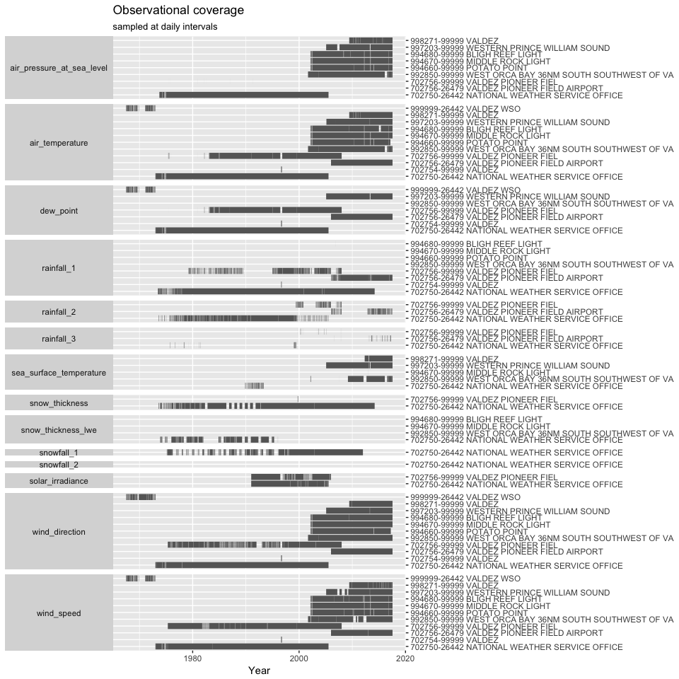

NOAA Integrated Surface Database (ISD)
======================================

Preview this [Data Package](http://specs.frictionlessdata.io/data-packages/) using the [Data Package Viewer](http://data.okfn.org/tools/view?url=https://github.com/columbia-glacier/noaa-isd).

Data
----

### Description

The data includes meteorological observations from nearby weather stations ([map](https://gis.ncdc.noaa.gov/maps/ncei/cdo/hourly)):

-   Valdez (National) Weather Service Office
    -   702750-[26442](https://www.ncdc.noaa.gov/cdo-web/datasets/LCD/stations/WBAN:26442/detail)
    -   999999-[26442](https://www.ncdc.noaa.gov/cdo-web/datasets/LCD/stations/WBAN:26442/detail)
-   Valdez Pioneer Field Airport
    -   702756-[26479](https://www.ncdc.noaa.gov/cdo-web/datasets/LCD/stations/WBAN:26479/detail)
    -   702756-99999
    -   702754-99999
-   998271-99999 Valdez
-   994660-99999 Potato Point
-   994670-99999 Middle Rock Light
-   994680-99999 Bligh Reef Light
-   997203-99999 Western Prince William Sound
-   992850-99999 West Orca Bay

### Sources

[NOAA Integrated Surface Database FTP Access](ftp://ftp.ncdc.noaa.gov/pub/data/noaa/)
